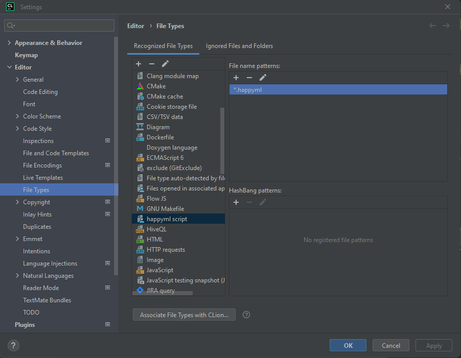
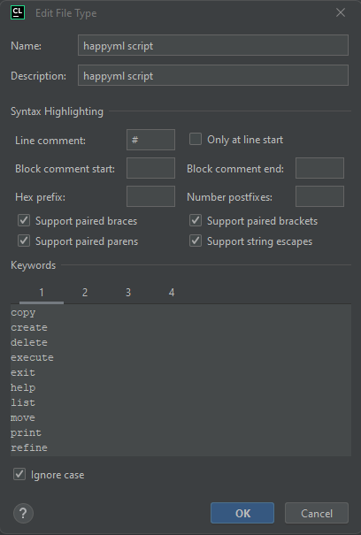

# Keywords
[Back to the table of contents](README.md)

You can use these keywords to setup syntax highlighting in your editor. CLion has 4 groups of keywords, so I'm going
to split them into four groups.

Add *.happyml to the file type pattern and then add the keywords to the appropriate group. Here's what it looks like:



Hit ctrl-alt-s while in a happyml file to bring up the settings or navigate to the happyml file type manually, then
add the keywords:



Current keywords are:
### Control Keywords
```happyml
copy
create
delete
describe
execute
exit
help
list
move
print
refine
set
```
### Types
```happyml
accuracy
dataset
datasets
future
image
input
label
memory
number
speed
task
tasks
text
```
### Operational Keywords
```happyml
at
expected
given
goal
header
limit
pretty
raw
starting
test
to
using
with
```
### Path indicators
```happyml
file://
http://
https://
```
